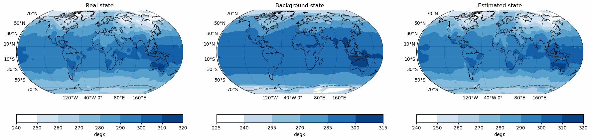

# Weather-Forecasting-Reanalysis-II-CNN-DA

## Air Temperature


## V-wind component


## U-wind component


## Create and activate conda environment

```
conda create -n wf python=3.9
conda deactivate
conda activate wf
```

## Install main dependencies

```
conda install -c conda-forge iris
pip install basemap
pip install optuna
pip install pandas
```

## Install tensorflow with GPU
[Tensorflow - Guide](https://www.tensorflow.org)


## Download train .nc data and create netCDF data:

```
python download-data.py <start_date> <end_date> #YYYY
```

## Download test .nc data and create netCDF data:

```
python download-test-data.py <start_date> <end_date> #YYYY
```
